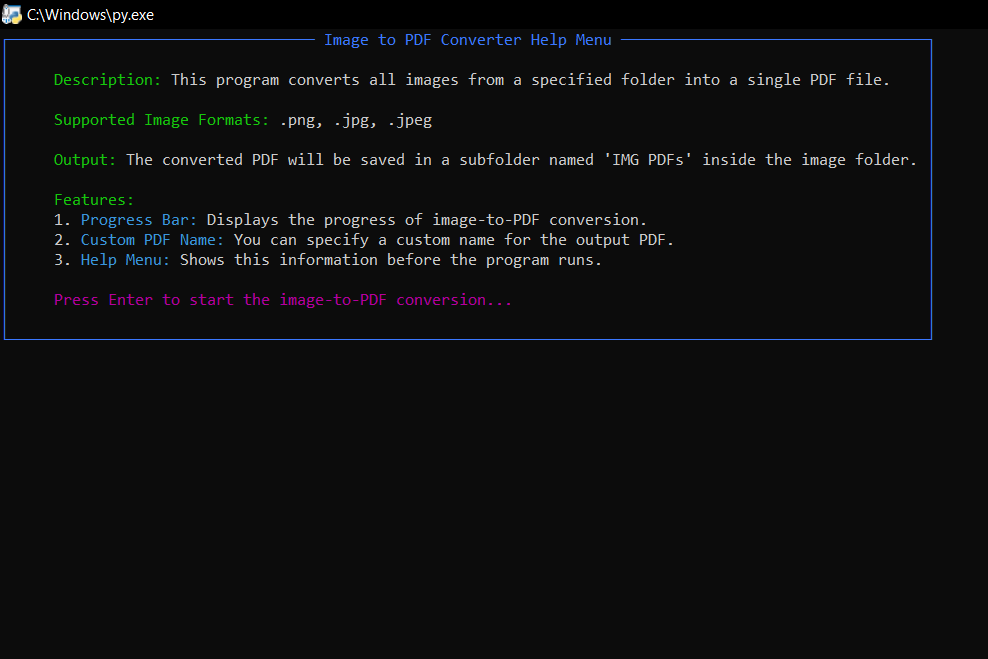
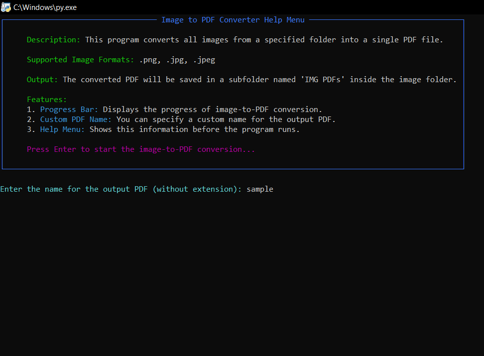
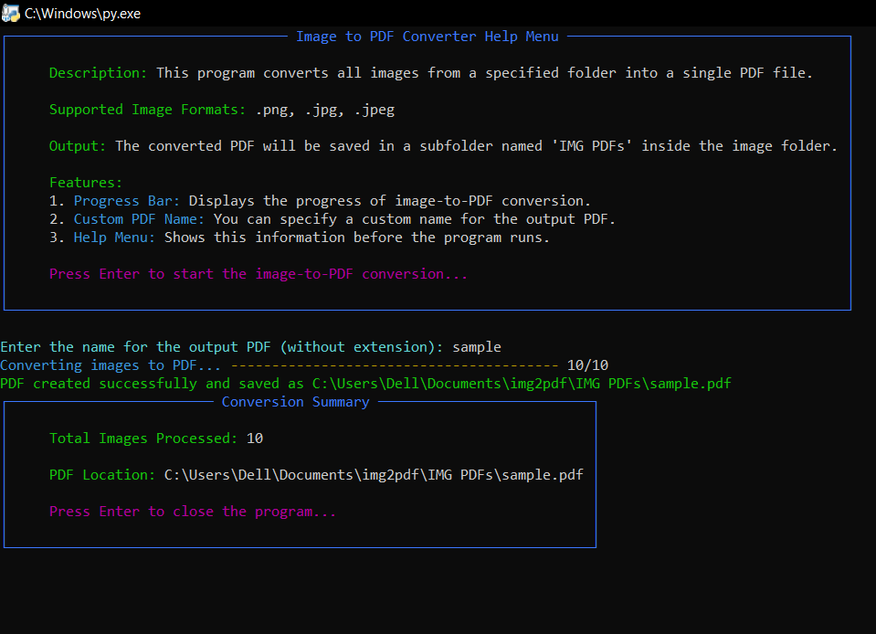
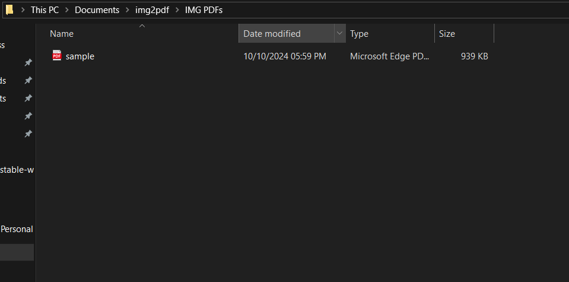
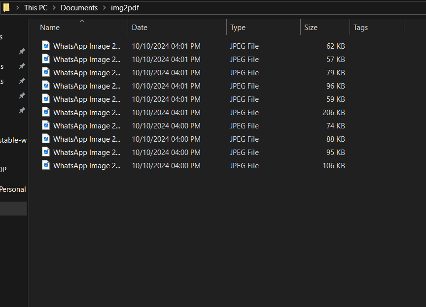

# Image to PDF Converter


## Description

This **Image to PDF Converter** is a user-friendly Python-based tool that converts images from a specified folder into a single PDF file. The program supports popular image formats like PNG, JPEG, etc., and features a progress bar to show conversion status in real-time. It allows users to input a custom PDF name and provides a detailed summary once the conversion is complete.

## Features

- **Progress Bar**: Displays real-time progress during the conversion process using the Rich library.
- **Custom PDF Name**: Users can specify their desired name for the output PDF.
- **Summary Tab**: A detailed summary shows the total images processed and the location of the saved PDF.
- **Help Menu**: A help menu is shown before running the conversion, explaining how to use the tool.

## Supported Image Formats

- `.png`
- `.jpg`
- `.jpeg`

## Installation (Windows Only)

Follow these steps to install and run the Image to PDF Converter on Windows:

### 1. Install Python (Latest Version)
If you haven't installed Python yet, you need to download and install the latest version of Python from the [official Python website](https://www.python.org/downloads/).

#### Installation Steps:
- Go to the [Python Downloads](https://www.python.org/downloads/) page.
- Download the latest version suitable for Windows.
- Run the installer, and during the setup, make sure to check the box that says **"Add Python to PATH"** before clicking on **Install Now**.

### 2. Download or Clone the Repository
- You can either download the ZIP of this repository or clone it using Git.

#### To clone the repository:
```bash
git clone https://github.com/012Abhishek/img2pdf-converter.git
```

Alternatively, download the ZIP and extract it.

### 3. Open Command Prompt
- Press Win + R, type cmd, and hit Enter to open the command prompt.

### 4. Navigate to the Project Directory
- In the command prompt, navigate to the folder where you downloaded or cloned the project by using the cd command.
```bash
cd C:\path\to\img2pdf-converter
```

### 5. Install Required Libraries
- To install the required Python libraries, execute the following command in the command prompt:
```bash
pip install -r requirements.txt
```

#### This will install the following dependencies:
- Pillow for image handling.
- Rich for console design and progress bars.

### 6. Change the Image Folder Path in the Code
- Edit the Python script (img2pdf.py) to update the image_folder path with the location where your images are stored. Open the file using any text editor and modify the following line:
```bash
image_folder = r'' (Example: r'C:\path\to\img2pdf')
```
Replace the path with your actual image folder path.

### 7. Place Images in the img2pdf Folder
- Put all the images you want to convert into the folder you specified as the image_folder.

### 8. Run the Program
- Now, run the program by executing the following command:
```bash
python img2pdf.py
```
or Double click on the python file

### 9. Follow the prompts:
- A help menu will be displayed at the start.
- You'll be asked to input the name of the PDF file you want to create.

### 10. Conversion Summary
- Once the conversion is done, a summary tab will display the number of images processed and where the PDF is saved. Press Enter to close the program.

## Creator
I am Abhishek Chauhan, a B-Tech 4th-year student at Sharda University. This project is part of my learning journey in Python development, focusing on practical utilities and user-friendly interfaces.

## License
This project is licensed under the MIT License - see the [LICENSE](https://github.com/thakurmanoj002/img2pdf-converter/blob/main/LICENSE) file for details.

## Scereenshots

#### Help Menu Starting

#### User Input to give PDF name

#### Complete Conversion

#### PDF form Sample Images

#### Sample Images



